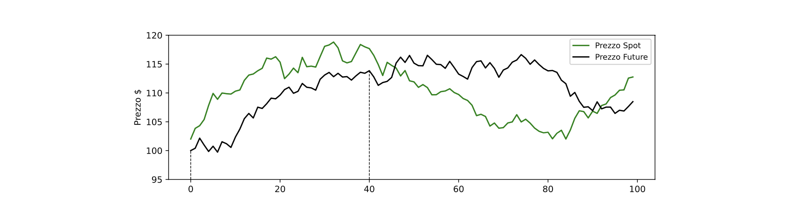
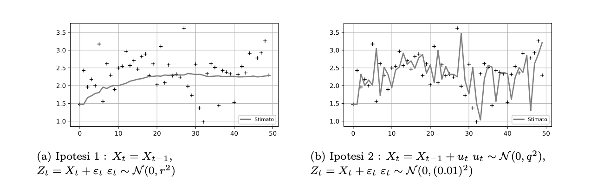
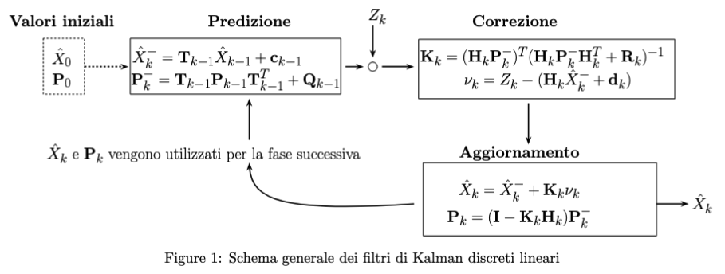
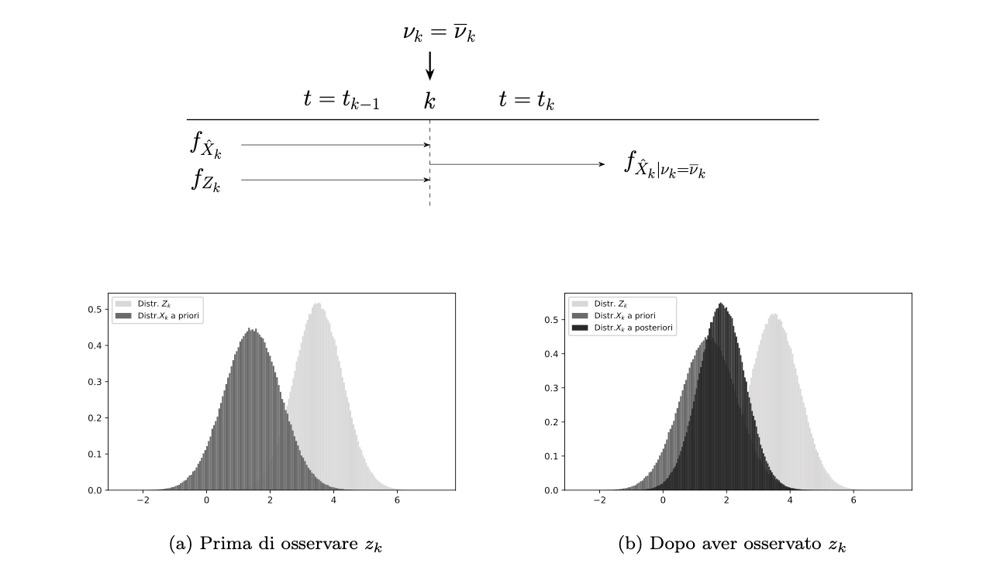
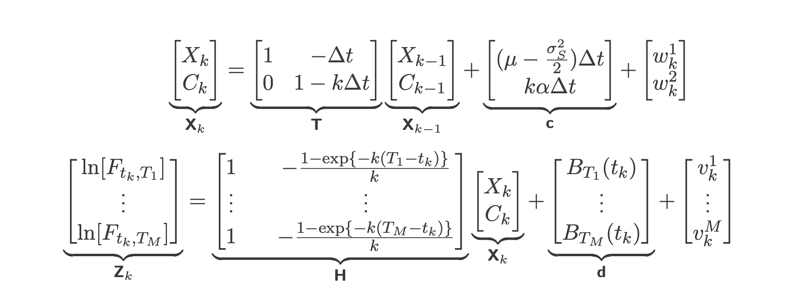
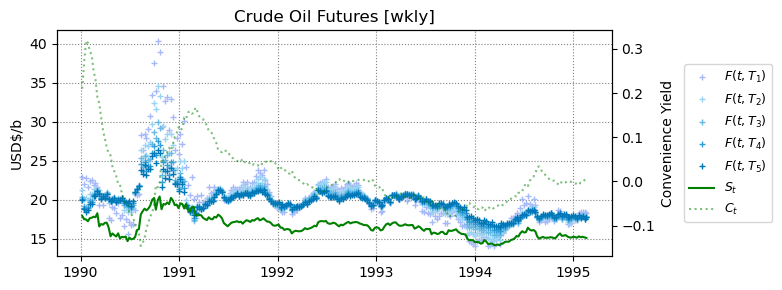

# Kalman filter in Finance

The main feature of Futures based on the commodity **Crude Oil** is that the spot price $S_t$ of this commodity is not directly observable in the financial markets. What is observable is only the price this takes on the various derivative financial instruments (Futures) that guarantee delivery in the future. Getting more specific, the problem arises where the green line is not directly observable at time $t$, in fact, on commodities such as crude oil (WTI Crude oil) there is no direct access to this variable. This happens because much of the crude oil traded in the world belongs to the over-the-counter (OTC) market, that is, the set of trades that take place outside the official financial circuits and that make the exchange of this commodity non-standardized with respect to the contracts found in the financial markets. The following project aims to apply a filtering technique known in the literature as Kalman filtering in order to estimate a possible reconstruction of the $S_t$ spot price. The particularity of Kalman filtering is that it is based on a hypothesis of the evolution of the variable that is not directly observable ($S_t$), and on the basis of this and an observable quantity (which will be the price of the futures $F_t$ based on the same commodity) it predicts the future step that the unobservable variable will take

## Motivation
The spot price $S_t$ of a commodity is the price that the commodity has at a given time $t$. The main problem in the study of variables that are not directly observable is that they must be reconstructed ex post, and verify the possibility that the observable process could actually have been generated by these reconstructions. Thus, an algorithm becomes necessary that, based on initial assumptions about the evolution of a process, can reconstruct the latter independently.
This algorithm reflects in a very general way the assumptions being made about process evolution (not directly observable) and process measurement (directly observable). A Kalman filter is a tool designed to fit these assumptions.

A Kalman filter needs an assumption of evolution of the hidden variable (usually defined by the notation $X_t$) and an assumption of evolution of the observable variable (usually defined by the notation $Z_t$). For example, if one assumes that one is observing a constant (at each time $X_t = c)$, the system has an evolution of the type $X_t = X_{t-1}$ trivially, and that then the problem is the observation at time $t$, $Z_t$, is affected by Gaussian noise, i.e., $Z_t = X_t + ε_t$ with $ε_t ∼ N (0, r^2)$. An alternative assumption that can be made is that instead it is the process itself that is affected by Gaussian noise , i.e., $X_t = X_{t-1} + u_t$ with $u_t ∼ N (0, q^2)$ and that the measurement made is very precise and actually reflects the state $X_t$ with very little uncertainty, i.e., $Z_t = X_t + ε_t$ with $ε_t ∼ N (0, (0.1)^2)$. Thus, a Kalman Filter reflects in a very general way the assumptions that are made about process *evolution* (not directly observable,  Spot price for example) and *process measurement* (directly Futures price). A Kalman filter is a tool designed to fit these assumptions; The figure below shows the two examples just mentioned and how the filter fits the assumptions made.

### About the filter 
Without going into too much theoretical detail, which can be studied in any signal theory book, we therefore want to describe how the whole filtering process acts in general. The following image shows a general schematic of Linear filtering

What is special about the Kalman filter is that it hypothesizes a theoretical evolution and corrects it with a measurement. It sounds like fantastic, as it performs a mix of theory and reality that all Machine Learning scholars always like. Just to give some mathematical context in the image below you can see how in the prediction step both the variable $X_t$ and the variable $Z_t$ have their own Gaussian distribution, in particular the distribution of $X_t$, in dark gray in the image on the left, represents the theoretical distribution predicted by that variable before making an observation about reality ($Z_t$). In the image on the right, you can see how after measuring $Z_t$, a new distribution is created for $X_t$ called the “a posteriori” distribution.

Expressed in the financial problem under consideration, we assume how the spot price $S_t$ of the raw material could be distributed, how the price of the Future based on the same raw material $F_t$ is distributed, and in accordance with the relationship that binds them (which we will see later)
we estimate the next value of $S_{t+1}$. It follows that from a historical trend of a future we can extract the historical trend of the spot price

### About the equations
In this section we will look at the implementation of a model that predicts the evolution of two hidden factors: the Gibson-Schwartz model (Gibson, Rajna Schwartz, Eduardo S, 1990. "Stochastic Convenience Yield and the Pricing of Oil Contingent Claims" Journal of Finance, American Finance Association, vol. 45(3), pages 959-976, July). This was captured by Lautier and Galli to study the parameters associated with the evolution of crude oil futures instruments from 1995 to 2002 (D. Lautier, A. Galli: "Simple and extended Kalman filters: an application to term structures of commodity prices" Applied Financial Economics, vol 14, n°13, p 963-974, Sept 2004). The system of equations consists of the log-spot price $X_t=\ln[S_t]$ of the commodity and $C_t$, the convenience yield. To best define the concept of convenience yield, one can think of the fact that physical possession of a commodity can bring advantages to the holder that the counterparty does not possess. These advantages are not monetary in nature, but rather constitute more of an advantage in terms of possibilities, which will certainly result in a monetary advantage in the end. Physical possession of crude oil is associated with a broader range of uses than someone who does not possess it, but at the same time physical possession is associated with storage and insurance costs that become difficult to overlook as far as crude oil refining is concerned: refiners will consider owning physical oil an advantage over owning a future that guarantees delivery of oil in 1 year's time. In the event of a crisis in the latter or sudden geopolitical events, refiners would be able to use the raw material for eventual production processing and a subsequent profit if needed, which the counterparty owning the future will not be able to do.
Clearly this will be something very difficult to estimate, but Kalman filters, when based on correct assumptions, make it possible to implement a fairly reliable reconstruction of how this convenience could have moved. Thus, the system of stochastic differential equations describing the trend of the oil spot price is composed of the trend of its logarithm according to a Geometric Brownian Motion dynamics with a drift that depends negatively on the convenience yield, and the convenience yield evolving according to an Ornstein-Uhlenbeck process:

$$
\begin{cases}
     dX_t = (\mu - C_t - \frac{\sigma_S^2}{2}) dt + \sigma_S dW_t^{(1)} \\
    dC_t = [k(\alpha - C_t)] dt + \sigma_C dW_t^{(2)}
\end{cases}
$$

Brownian motions $W_t^{(1)}$ and $W_t^{(2)}$ are are are correlated with coefficient $\rho$. So in order to discretize we take $\varepsilon_1$ and $\hat{\varepsilon}_1$ correlated standard normal random variables with coefficient $\rho$, it will then result $\hat{\varepsilon}_1=\rho\varepsilon_1+\sqrt{1-\rho^2}\varepsilon_2$, where clearly $\varepsilon_2$ is standard normal uncorrelated with $\varepsilon_1$.
This in a succession of discrete times (e.g., the daily market closures) becomes

$$
\begin{cases}
     X_{t+\Delta t} = X_{t} + (\mu - C_t - \frac{\sigma_S^2}{2}) \Delta t + \sigma_S \sqrt{\Delta t} \epsilon_1 \\
    C_{t+\Delta t} = C_t + [k(\alpha - C_t)] \Delta t + \sigma_C \sqrt{\Delta t} ( \rho \varepsilon_1 + \sqrt{1 - \rho^2} \epsilon_2)
\end{cases}
$$

Within this type of model, the Spot price $S_t$ and the Future price $F_t$ are linked theoretically by the following relationship, at time $t$:

$$
F_T(t, S_t) = \mathbb{E}^{\mathbb{Q}}[S_T \mid \mathcal{F}_t] 
$$

Where $\mathbb{Q}$ indicates the risk-neutral measure.
From this we can obtain a closed form for the Future price (which will be at the Kalman filter level the evolution of the measurement equation)

$$
F_T(t, S_t) = \mathbb{E}^{\mathbb{Q}}[S_T \mid \mathcal{F}_t] = S_t \cdot \exp\{ (-C_t \cdot \frac{1 - e^{-k(T - t)}}{k} + B_T(t)) \}
$$

Where the function $B_T(t)$ is defined as:

$$
\begin{aligned}
B_T(t) :=\ & (T - t) \left(r - \alpha + \frac{\lambda}{k} + \frac{\sigma_C^2}{2k^2} - \frac{\sigma_S \sigma_C \rho}{k} \right) \\\\
& + \frac{1 - e^{-k(T - t)}}{k^2} \left(k\alpha - \lambda + \sigma_S \sigma_C \rho - \frac{\sigma_C^2}{k} \right) \\\\
& + \left(1 - e^{-2k(T - t)}\right) \cdot \frac{\sigma_C^2}{4k^3}
\end{aligned}
$$

We now have all the ingredients to define the Kalman filter of the following design, in fact we have an equation describing the unobservable variables and an equation describing the observable variables (we speak in the plural because we can use several futures at a time, each with a different maturity) . Thus, the following evolution over the time period $\Delta t$ is obtained:

Regarding the covariance matrices, the matrix of unobservable variables $Q$ is

$$
\mathbf{Q}_k =
\begin{bmatrix}
\sigma_S^2 \, \Delta t & \sigma_S \sigma_C \rho \, \Delta t \\
\sigma_S \sigma_C \rho \, \Delta t & \sigma_C^2 \, \Delta t
\end{bmatrix}
$$

As matrix $R$, we take a rescaling with a constant $C$ of the correlation matrix of the $M$ observed futures. Specifically:

$$
\mathbf{R}(C) = C
\begin{bmatrix}
1 & c_{12} & c_{13} & \cdots & c_{1M} \\
c_{21} & 1 & c_{23} & \cdots & c_{2M} \\
c_{31} & c_{32} & 1 & \cdots & c_{3M} \\
\vdots & \vdots & \vdots & \ddots & \vdots \\
c_{M1} & c_{M2} & c_{M3} & \cdots & 1 \\
\end{bmatrix}
$$

where

$$
c_{ij} = \frac{
\sum\limits_{t=1}^N \left(Z^i_t - \bar{Z}^i\right) \left(Z^j_t - \bar{Z}^j\right)
}{
\sqrt{\sum\limits_{t=1}^N \left(Z^i_t - \bar{Z}^i\right)^2}
\sqrt{\sum\limits_{t=1}^N \left(Z^j_t - \bar{Z}^j\right)^2}
}
$$

## Parameters
If we have not yet discussed the family of parameters that cause the model to evolve over time, this will come up as soon as we try to implement the model. It is important to remember that we are evolving the state of a system that is not directly observable. If the evolution parameters were known, then a simple implementation of the model would be enough.  
The maximum likelihood method helps to estimate the parameters. Since the likelihood function (generally associated with a sample of independent and identically distributed observations $X_1,...,X_n$) can be factorized into the product of the marginal distributions $f_{X_i} (x_i)$, this may suggest that an iterative method such as Kalman filters may lend itself to adding (day after day) a “piece” of the likelihood function, and once many observations have been accumulated, this function can be maximized and provide a convincing approximation of the parameters of a stochastic model. 
The main problem with the type of processes described by state equations of the type  is that the observations that accumulate over time are not independent. It is therefore appropriate to provide a representation of the likelihood function that takes this correlation of observations into account.  
Suppose we have accumulated $n$ observations after a period of time; the joint probability density will be factorizable as follows

$$
\begin{equation*}
\begin{aligned}
    f_{X_1,..,X_n}(x_1,..,x_n)&=f_{X_n|X_{n-1},..,X_1}(x_{n}|x_{n-1},..,x_1)\\
    &=f_{X_{n-1}|X_{n-2},..,X_1}(x_{n}|x_{n-1},..,x_1)f_{X_{n-1},..,X_1}(x_{n-1},..,x_1)\\
    &=f_{X_1}(x_1)\prod_{i=1}^{n-2}f_{X_{n-i}|X_{n-1-i},..,X_1}(x_{n-i}|x_{n-1-i},..,x_1).
\end{aligned}
\end{equation*}
$$

The likelihood function is then expressed in logarithmic form, which must be maximized as a function of the parameters contained in the vector $\phi$. The normal distribution of the variables $X_i\sim \mathcal{N}(\mu_i,\sigma^2_i)$ is taken into account:

$$
\begin{equation*}
\begin{aligned}
   \log\mathcal{L}\big(x_1,...,x_n|\phi \big)&= \log\big[f_{X_1}(x_1)\big]+\sum_{i=1}^{n-2}\log\big[f_{X_{n-i}|X_{n-1-i},..,X_1}(x_{n-i}|x_{n-1-i},..,x_1)\big]\\
   &=-\frac{1}{2}\log \big[2\pi\sigma^2_1 \big]-\frac{1}{2}\frac{(x_1-\mu_1)^2}{\sigma_1^2}-\sum_{i=1}^{n-2}\frac{1}{2}\log \big[2\pi\sigma^2_{n-i} \big]+\frac{1}{2}\frac{(x_{n-i}-\mu_{n-i})^2}{\sigma_{n-i}^2}.
\end{aligned}
\end{equation*}
$$

We must now ask ourselves what the Gaussian variables are and what their respective means and covariances are. Recall the expressions for the respective distributions of $\hat{X}_k$ and $Z_k$ at time $k-1$

$$
\begin{equation}
\begin{aligned}
\hat{X}_k &\sim \mathcal{N}(\hat{x}^{-}_k,\textbf{P}^{-}_k)\\
Z_k &\sim \mathcal{N}(\textbf{H}_k\hat{x}^{-}_k+\textbf{d}_k,\textbf{H}_k\textbf{P}^{-}_k\textbf{H}^T_k+\textbf{R}_k)
\end{aligned}
\end{equation}
$$

Note that this is the general form for the measurement vector, but in financial applications what is observed from the market has a scalar form, so the terms of mean and variance will be scalars, instead of a matrix  $\mathbf{R}_k$ we will have the variance of the measurement error $v_k$. In the cases discussed in this elaborate, the random variable representing the measurement will have the following probability density function, where $\nu_k={z}_k - (\mathbf{H}_k \hat{{x}}^{-}_k+\textbf{d}_k)\in \mathbb{R}^m$

$$
\begin{equation*}
    f_{Z_k}(z_k)=\frac{\exp \{ -\frac{1}{2} \nu_k(\mathbf{H}_k \mathbf{P}^{-}_k \mathbf{H}_k^T + \mathbf{R}_k)^{-1}  \nu_k^T \}}{\[(2\pi)^m |\mathbf{H}_k \mathbf{P}^{-}_k \mathbf{H}_k^T + \mathbf{R}_k|\]^{1/2}}.
\end{equation*}
$$

Therefore, at time step $k$, the log-likelihood component to be added will be

$$
\begin{equation*}
   l^{\phi}_k=-\frac{m}{2}\log \[2\pi\]-\frac{1}{2}\log\[|\mathbf{H}_k \mathbf{P}^{-}_k \mathbf{H}_k^T + \mathbf{R}_k|\] -\frac{1}{2} \nu_k(\mathbf{H}_k \mathbf{P}^{-}_k \mathbf{H}_k^T + \mathbf{R}_k)^{-1}  \nu_k^T 
\end{equation*}
$$

Therefore, once the filters have been run over a sufficiently wide time window, and after accumulating several components $l^{\phi}_k$, an estimate of the parameters will be obtained using the maximum likelihood method. Although the method of maximizing this function is the best, you can also try a faster approach, which consists of trying a set of random parameters and calculating the likelihood value that would be obtained with these along the historical series using the Kalman filter. Once enough sets have been tried, the one that has achieved the lowest negative log likelihood value is taken. (Spoiler: I used this, but if you are interested, you can also add a method that minimizes the negative log likelihood with scipy.optimize to the class).

Why did I use this? Because this model has many parameters and, with few observations, optimization often failed.

## Example of results
Best parameters found with a Random Grid Search on 10 000 sets of parameters:  
$k$= 2.844   
$\alpha$= -0.048  
$\mu$= 0.350  
$\lambda$= 0.098  
$\sigma_S$= 0.229  
$\sigma_C$= 0.095  
$\rho$= -0.981  

With these parameters, the following estimated trend for the spot price $S_t$ and convenience yield $C_t$ (dotted green line and shown on the right scale) can be obtained.

## How to contribute

As can be seen, the general class is called Kalman Finace and involves the use of this generic filtering technique, applied however to a *specific* financial problem: the reconstruction of the trend in the spot price of crude oil given the price of futures having this commodity as underlying. It would be nice if, any of you reading this, knew of another financial problem where a Kalman filter can be used. The ingredients for it were explained above, and I hope that one day this class can accommodate a type of financial problems that I was not aware of. The final desire would be to have a repository where, depending on the financial problem you want to solve, a specific type of Kalman filter intervenes. Enjoy !

